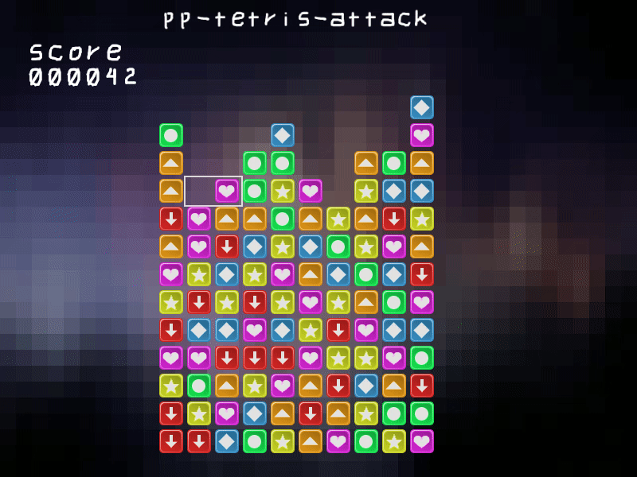
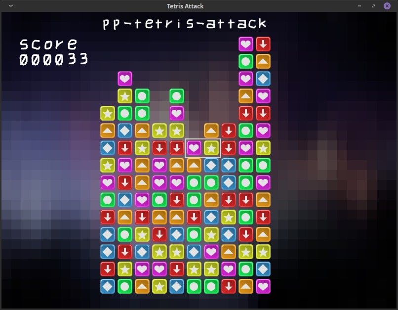

# pp-tetris-attack

This is just an another "recreational" project. I've wanted to code a game in C++ and focus more on programming/learning new things than spending time on design.

So what's one of the greatest games in the universe? **Tetris Attack** on Super-Nintento (https://en.wikipedia.org/wiki/Tetris_Attack). It's my attempt on remaking the game. Still at very early work-in-progress state.

## Libs

- SFML library (https://www.sfml-dev.org/).

## Compile

If required libs are present code should compile after executing ./compile-and-run.sh.

## Screenshot

